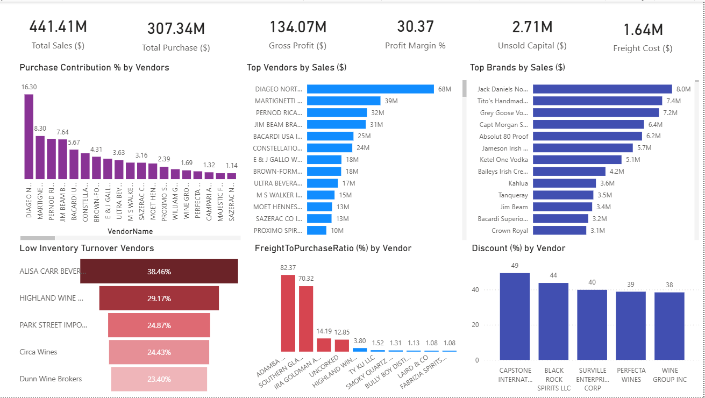

# **Vendor Performance Analysis**

**SQL • Python (Pandas, Matplotlib, Seaborn) • Power BI • Excel**

---

## **Project Overview**

This project analyzes vendor performance using procurement data to help businesses understand vendor contribution, cost drivers, and purchasing patterns. The analysis follows a structured data analytics workflow, from business problem definition to dashboard creation, using SQL, Python, and Power BI.

---

## **Business Problem**

Effective vendor and procurement management is critical for controlling costs and improving operational efficiency. Organizations often face challenges such as vendor dependency, high freight costs, and uneven vendor contribution.
The objective of this project is to evaluate vendor performance based on purchase value, freight cost, and order volume to support better procurement decision-making.

---

## **Project Flow**

1. Understanding the business problem
2. Exploring and cleaning data using SQL
3. Performing exploratory data analysis (EDA) using Python
4. Building an interactive Power BI dashboard
5. Reporting insights for decision support

---

## **Data Source**

Kaggle Dataset:
[https://www.kaggle.com/datasets/harshmadhavan/vendor-performance-analysis](https://www.kaggle.com/datasets/harshmadhavan/vendor-performance-analysis)

---

## **SQL Data Analysis & Cleaning**

* Explored procurement and invoice-related tables using SQL
* Cleaned and merged multiple tables
* Created aggregated vendor-level datasets
* Analyzed key metrics such as:

  * Purchase value
  * Freight cost
  * Order quantity

---

## **Exploratory Data Analysis (EDA)**

* Conducted EDA using **Python (Pandas)** to understand vendor contribution and cost distribution
* Visualized insights using **Matplotlib and Seaborn**, including:

  * Purchase value distribution across vendors
  * Freight cost vs order quantity relationships
  * Top vendors contributing to procurement value
* Identified vendors with high costs and low contribution

---

## **Power BI Dashboard**

Here’s a clean, professional version you can directly use in your **README / resume project section** — structured and concise 👇

---

### Vendor Performance Analysis – Power BI Dashboard

* Developed an interactive **Power BI dashboard** to analyze and evaluate vendor performance across sales, purchases, profitability, and operational efficiency.

**Dashboard Highlights:**

**KPI Cards (6):**

* Total Sales
* Total Purchase
* Gross Profit
* Profit Margin (%)
* Unsold Capital
* Freight Cost

**Visualizations (6):**

* Purchase Contribution (%) by Vendor
* Top Vendors by Sales
* Top Brands by Sales
* Low Inventory Turnover Vendors
* Freight-to-Purchase Ratio (%) by Vendor
* Discount (%) by Vendor

---

## **Tools & Technologies**

* **SQL** – Data extraction, joins, aggregation, and cleaning
* **Python** – Pandas, Matplotlib, Seaborn for EDA
* **Power BI** – Dashboarding and KPI visualization
* **Excel** – Performed basic Vendor Performance Analysis
---

## **Key Insights**

* A small group of vendors contributes a significant portion of total purchase value
* Certain vendors incur disproportionately high freight costs
* Vendor performance varies significantly across cost and volume metrics

---

## **Conclusion**

This project demonstrates a complete data analytics workflow to evaluate vendor performance using SQL, Python, and Power BI. The insights help identify cost inefficiencies and support data-driven procurement decisions.

---

## **Future Enhancements**

* Add time-based trend analysis
* Automate data refresh in Power BI
* Extend analysis to vendor risk or cost anomaly detection

