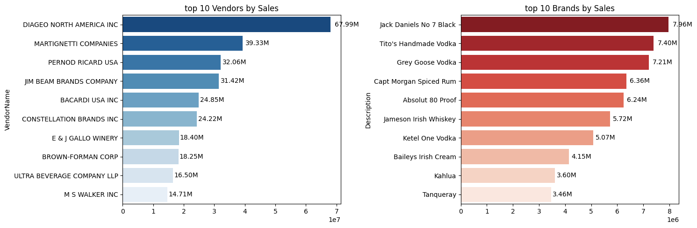
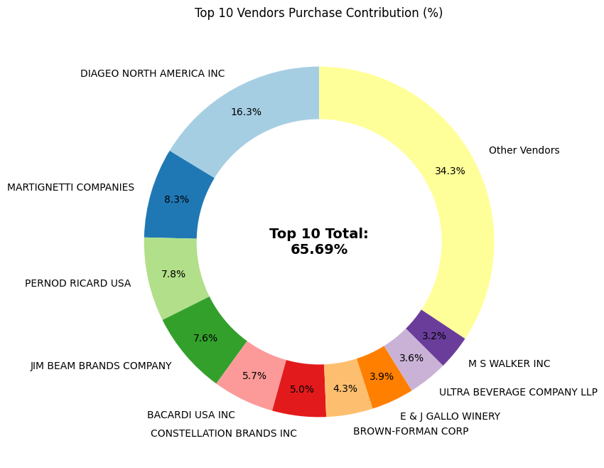
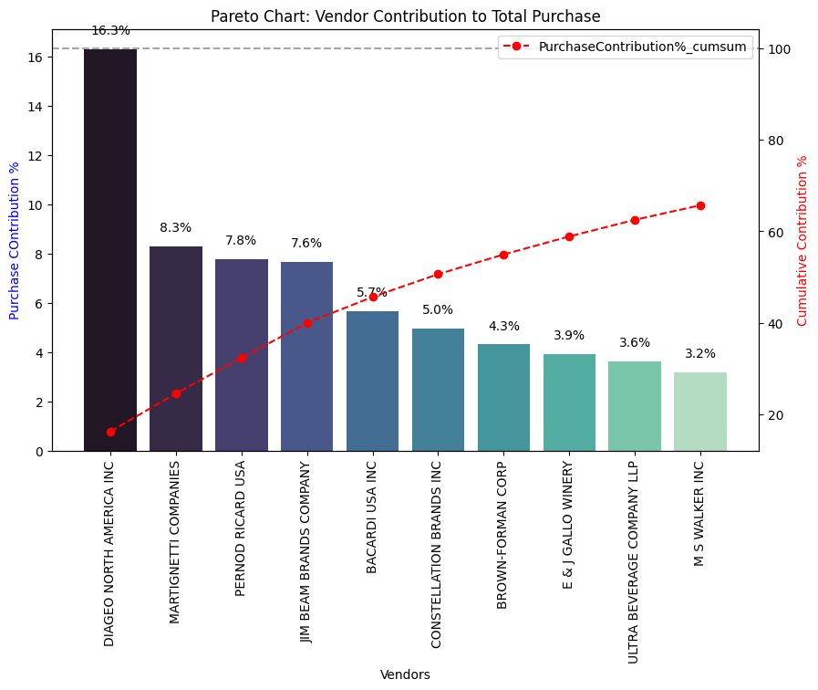
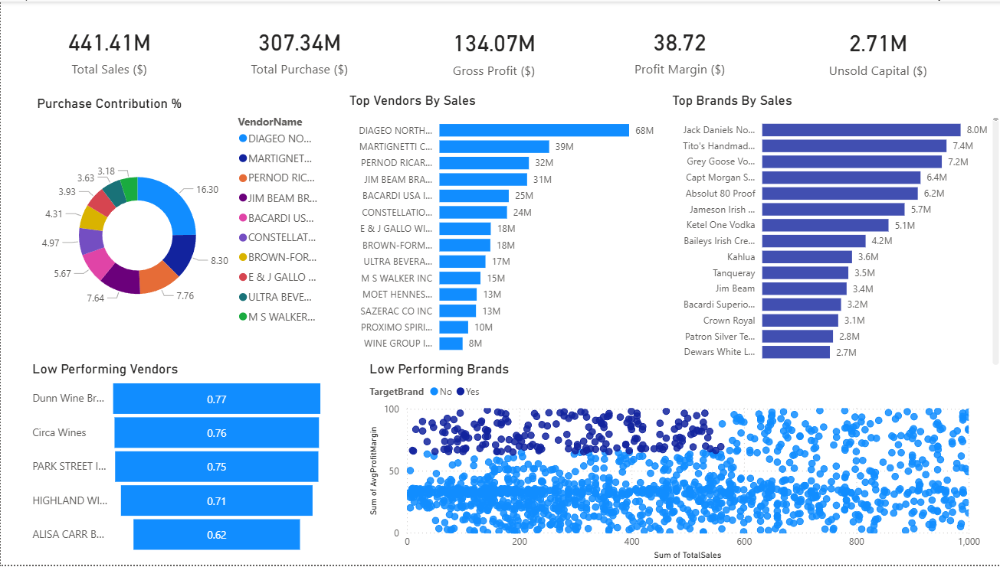

# 📦 Vendor Performance Analysis

**SQL • Python (Pandas) • Power BI**

## 📌 Project Overview

This project focuses on analyzing vendor performance using supply chain and procurement data. The goal is to evaluate vendors based on key metrics such as purchase value, freight cost, order volume, and contribution to total procurement. The analysis helps identify high-performing vendors, cost drivers, and optimization opportunities for procurement decision-making.

## 📥 Data Source
- Kaggle Dataset: https://www.kaggle.com/datasets/harshmadhavan/vendor-performance-analysis

---

## 🎯 Objectives

* Evaluate vendor performance using quantitative supply chain metrics
* Identify vendors contributing the most to procurement value and cost
* Analyze freight and purchasing patterns across vendors
* Build an interactive dashboard for vendor-level insights

---

## 🗂️ Dataset Description

The dataset consists of procurement and invoice-related tables containing vendor-level transaction data.

### Key Fields:

* **VendorNumber** – Unique vendor identifier
* **VendorName** – Name of the vendor
* **PurchaseValue** – Total purchase amount
* **FreightCost** – Freight charges associated with purchases
* **OrderQuantity** – Total quantity ordered
* **InvoiceDate** – Transaction date

---

## 🛠️ Tools & Technologies

* **SQL** – Data extraction, joins, aggregation, and transformations
* **Python (Pandas, Matplotlib, Seaborn)** – Data cleaning and exploratory data analysis
* **Power BI** – Interactive dashboard and KPI visualization

---

## 🔍 Data Processing & Analysis

* Cleaned and merged multiple database tables using SQL queries
* Aggregated vendor-level metrics such as total purchases, freight costs, and order volumes
* Performed exploratory data analysis (EDA) in Python to understand vendor contribution and cost trends
* Identified top-performing and high-cost vendors based on key KPIs

---

## 📊 Exploratory Data Analysis (EDA)

The EDA focused on understanding vendor behavior and cost distribution.

### Example Insights:

* Distribution of purchase value across vendors
* Relationship between freight cost and order quantity
* Identification of vendors with high cost but low contribution

📷 **EDA Visuals:**

* Top 10 Vendors and Brands by Sales

* Top 10 Vendors Purchase Contribution

* Pareto Chart


---

## 📈 Power BI Dashboard

An interactive Power BI dashboard was developed to track vendor performance and procurement KPIs.

### Dashboard Features:

* Top vendors by purchase value
* Freight cost contribution analysis
* Vendor-wise KPI comparison
* Filters for dynamic vendor exploration

🔗 **Power BI Dashboard Preview:**


---

## 📂 Project Structure

```
Vendor-Performance-Analysis/
│
├── data/                                
├── eda_notebooks/           
├── images/      
├── logs/        
├── powerbi_dashboard/
├── scripts/        
├── requirements.txt        
└── README.md                
```

---

## 📌 Key Insights

* A small group of vendors contributes a significant share of total purchase value
* Certain vendors incur disproportionately high freight costs
* Vendor performance varies significantly across cost and volume metrics

---

## 🚀 Conclusion

This project demonstrates how data analysis can support procurement and supply chain decision-making. By combining SQL, Python, and Power BI, the analysis provides actionable insights into vendor performance and cost optimization opportunities.

---

## 📎 Future Enhancements

* Automate data refresh for real-time dashboard updates
* Add trend analysis over time
* Extend analysis to predict vendor risk or cost anomalies

